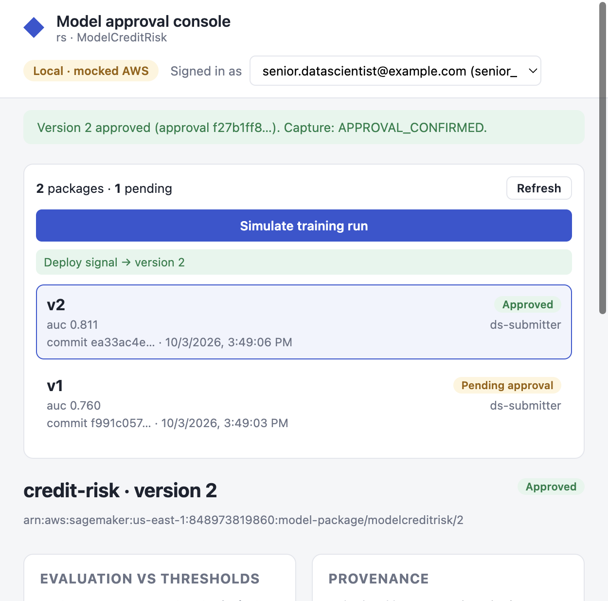

# credit-risk POC

A small model repository that exercises the ML Platform v7 lifecycle end to end with a
credit-risk classifier trained on synthetic data. The platform code (`ml_platform`, Lambdas,
Terraform) lives in [ML-Platform](https://github.com/Debashis2007/ML-Platform); this repo only
holds the model, its configuration and the train workflow.

> **POC deviation:** training runs in the control plane NonProd account
> (`aws.training_target: control_plane`). The v7 target state trains in the BU account; only the
> `aws` block in `model.yaml` changes.

## Layout

| Path | Purpose |
|------|---------|
| `model.yaml` | Model configuration: accounts, data, thresholds, registry group, deployment targets, approvers |
| `train.py` / `evaluate.py` | Training and evaluation scripts run by the SageMaker pipeline |
| `preprocess.py` | Optional prepare step (`steps.prepare.enabled`) |
| `inference.py` / `Dockerfile` | Serving image, pushed to ECR and pinned by digest |
| `scripts/make_synthetic_data.py` | Synthetic numeric dataset with a `default` target |
| `tests/` | Local smoke test: data, train, evaluate, threshold gate, `model.yaml` validation |
| `.github/workflows/ml-lifecycle.yml` | Test on every PR; build image and start the pipeline on `main` |
| `scripts/local_e2e.py` | Full lifecycle against mocked AWS |
| `ui/` | Approval console: React frontend (`ui/frontend`), FastAPI backend (`ui/backend`) |

## Run locally

```bash
python3 -m venv .venv && source .venv/bin/activate
git clone --branch feature/v7-alignment https://github.com/Debashis2007/ML-Platform.git .platform
pip install -r .platform/requirements.txt -r requirements.txt -r requirements-dev.txt
export PYTHONPATH=$PWD/.platform

python -m pytest tests/ -q                                  # all tests, including mocked-AWS lifecycle
python -m ml_platform.build_pipeline --config model.yaml    # pipeline definition, no AWS calls
python scripts/local_e2e.py                                 # full v7 lifecycle against mocked AWS
```

### Full lifecycle against mocked AWS

`scripts/local_e2e.py` runs the v7 flow end to end with [moto](https://github.com/getmoto/moto)
mocking S3, DynamoDB, SageMaker (pipeline execution and model registry), ECR, SSM and
EventBridge. Fake credentials are forced, so it never touches a real account.

| Stage | Real code | Mocked |
|-------|-----------|--------|
| Image push | — | ECR repository and digest |
| Pipeline | `train.py`, `evaluate.py`, threshold gate, platform `publish_candidate.py` run locally | SageMaker pipeline execution and parameters, S3 staging |
| Registration | Platform `register_candidate` Lambda (checksum copy-in, evidence, `PendingManualApproval`) | S3, DynamoDB, model registry |
| Approval | Platform `approval_api` Lambda: self-approval refused (403), wrong hash refused (409), senior DS approval (200) | Okta claims passed as authorizer context |
| Capture | Platform `capture_approval_event` Lambda: API approval confirmed and deploy parameter set; console approval flagged as violation | SSM, EventBridge |

Promotion to Prod and endpoint releases are not part of the local run.

## Approval console (React + FastAPI)



A web console for senior data scientists to review candidates and approve or reject them.
Approval rules are enforced by the platform's management API, never by the console.

```bash
./ui/run_local.sh            # builds the frontend once, then serves http://127.0.0.1:8000
```

- **Local mode (default):** runs on mocked AWS. Two candidates are trained and registered at
  startup. Switch the signed-in user to see the API's checks: the submitter
  (`data.scientist@example.com`) is refused by separation of duties, the viewer is refused for
  lacking the role, and `senior.datascientist@example.com` can approve. Approvals run the
  capture Lambda, so the deploy signal and decision log update live. **Simulate training run**
  registers a new candidate; **Simulate console approval** approves outside the API to show
  violation detection.
- **Remote mode:** `MLP_CONSOLE_MODE=remote MLP_API_URL=https://<api-id>-<vpce-id>.execute-api.<region>.amazonaws.com/v1 ./ui/run_local.sh`.
  Packages are listed from the real registry with your AWS credentials (read-only), and
  decisions are sent to the private management API with the Okta access token pasted in the
  header. The API is private, so run the console from inside the VPC or over the VPN.

Frontend development with hot reload: run the backend as above, then `cd ui/frontend && npm run dev`
(http://127.0.0.1:5173, proxies `/api` to port 8000).

## Lifecycle

1. **Data:** generate and upload the training set to `data.train_uri`:
   ```bash
   python scripts/make_synthetic_data.py --rows 5000 --out data/train/train.csv
   aws s3 cp data/train/train.csv s3://ml-platform-data-848973819860/credit-risk/train/train.csv
   ```
2. **Train (this repo):** a push to `main` builds the image, pins it by digest, upserts pipeline
   `demo-credit-risk` and starts it. The pipeline runs Train, Evaluate, a gate on every threshold,
   then publishes `candidate.json`.
3. **Register (platform):** on pipeline success the `register_candidate` Lambda copies the model
   and evidence into the control plane with checksum verification and creates a
   `PendingManualApproval` package in `ModelCreditRisk`.
4. **Approve (platform):** a senior data scientist other than the submitter approves through the
   private management API (`POST /approvals`). Approvals made any other way are flagged as
   violations and never deploy.
5. **Promote and release (platform):** run the ML-Platform `ml-lifecycle` workflow for promotion
   by digest, Prod retrain and approval, then the QA and LIVE blue/green releases.

## GitHub setup

| Kind | Name | Value |
|------|------|-------|
| Environment | `ml-nonprod` | Add required reviewers if training should be gated |
| Secret (`ml-nonprod`) | `MLP_GHA_PIPELINE_ROLE_ARN` | OIDC role in the control plane NonProd account (client-managed) |
| Variable | `AWS_REGION` | `us-east-1` |
| Variable | `MLP_ARTIFACTS_BUCKET` | Control plane artifacts bucket for pipeline staging output |
| Variable (optional) | `MLP_PLATFORM_REF` | Platform branch or tag; defaults to `feature/v7-alignment` |
| Variable (optional) | `MLP_MODEL_REPOSITORY_PREFIX` | ECR prefix; defaults to `ml-models` |

The OIDC role trust policy must allow `repo:Debashis2007/credit-risk-poc:environment:ml-nonprod`.
IAM roles are client-managed; see `docs/CLIENT_MANAGED_IAM_ROLES.md` in ML-Platform.
